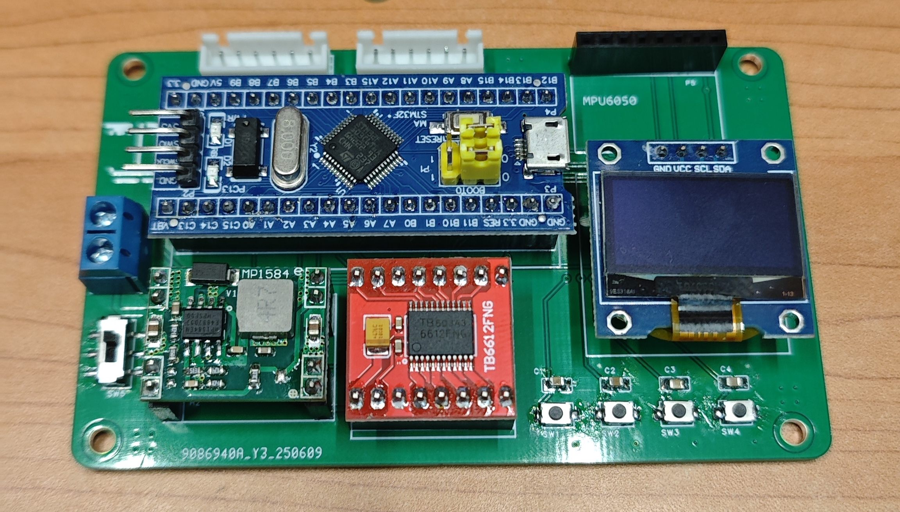
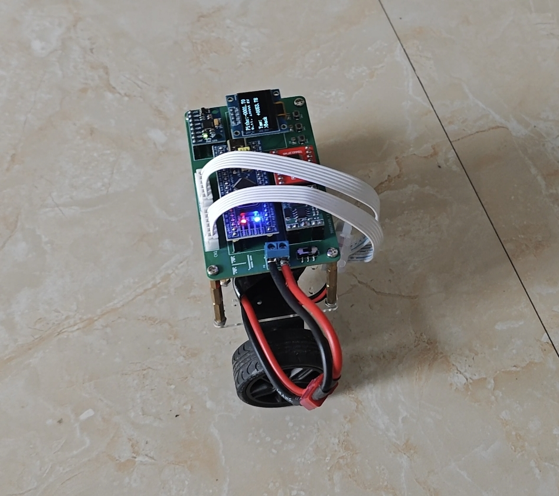

# 项目名称：STM32平衡车
## 介绍：
平衡车控制板由多个模块组合搭建而成，其中包括电机驱动，陀螺仪，电源模块等。主控芯片采用了STM32F103C8T6。通过陀螺仪实时获取姿态数据结合PID控制原理对平衡车姿态进行进一步调节，仅仅是PID控制的实现，没有遥控功能。
## 模块清单：
- 主控：STM32 blue pill
- 电机驱动：TB6612
- 陀螺仪：MPU6050
- 屏幕：0.96寸OLED模块
- 电源模块：12转5 DC-DC模块
## 主控板实物图：
主控板上增添了一个电源开关和四个按键，便于后续调参和菜单互动。

## 平衡车实物图：
如图所示，平衡车工作时，最小系统板上的蓝色LED亮起，屏幕显示平衡车姿态数据。

## 设计缺陷：
- 无法做到像网上展示平衡车效果，无法做到几乎平稳，总是会伴有轻微抖动。而且PID设计中，必须加入积分I，否则无法平衡，与网上传统的PD控制不同，目前没找到原因。
- 而且完成项目1个月时间后的后续测试中，发现当倾角过大修正时会出现烧掉blue pill背部线性稳压管的情况。这在刚完成项目时是没有体现的，目前也未解决，可能是pcb设计问题。

